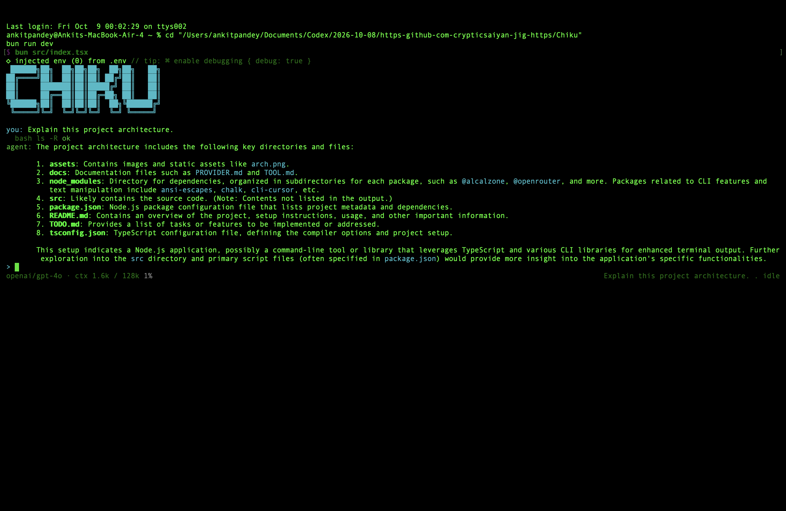
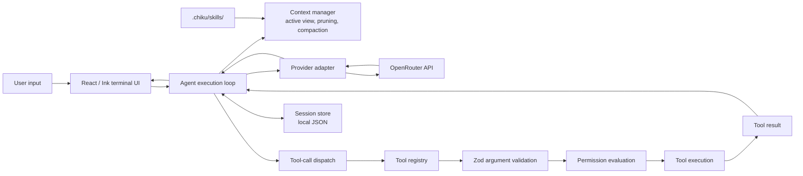
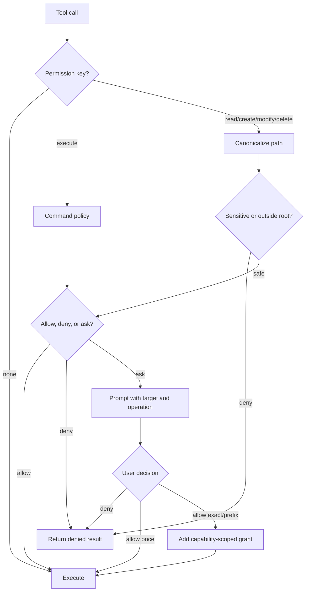
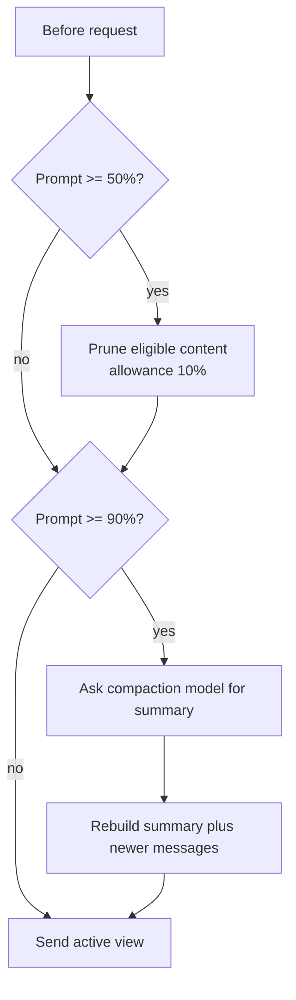
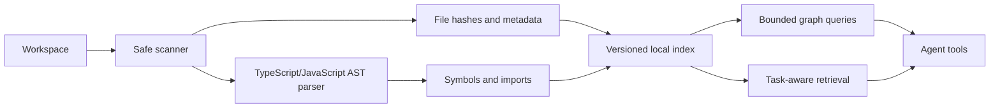

# Chiku

<div align="center">

### An Extensible Terminal-Native AI Coding Agent

Model reasoning, structured developer tools, permission-aware execution, context management, and persistent development sessions in an interactive terminal.

[](https://www.typescriptlang.org/)
[](https://bun.sh/)
[](https://openrouter.ai/)
[](https://github.com/vadimdemedes/ink)
[](LICENSE)

[Quick start](#quick-start) · [Architecture](#high-level-system-architecture) · [Tools](#tool-system) · [Security](#security-considerations)

</div>

## Project overview

Chiku is a terminal-native AI coding agent and harness. It is more than an LLM API wrapper: it owns the lifecycle around a model request, including prompt construction, context shaping, streamed responses, tool-call dispatch, argument validation, permission decisions, interruption handling, and session persistence.

The current runtime connects to OpenRouter, renders through React and Ink, and exposes a small set of project tools. It can inspect files, create files, make exact replacements, run non-interactive shell commands, and load local Markdown skills. Sensitive operations pass through human approval.

An explicitly configured local OpenAI-compatible endpoint is also supported for
private/offline workflows. Local mode is loopback-only by default, never falls
back to OpenRouter, and does not download or install model runtimes. See
[docs/LOCAL_MODELS.md](docs/LOCAL_MODELS.md) for the supported boundary and
limitations.

MCP is an optional extension. Explicitly configured servers can be connected with approval, discovered tools are namespaced as `mcp.<server>.<tool>`, and calls use the existing tool registry and external permission capability. No server is started or contacted automatically.

The deterministic adversarial fixture harness is documented in
[docs/SECURITY_RED_TEAM_REPORT.md](docs/SECURITY_RED_TEAM_REPORT.md). It tests
the real tool/permission boundary with synthetic content and does not claim
complete prompt-injection protection or OS-level sandboxing.

## Why Chiku?

- **Modular runtime:** provider communication, loop control, context engineering, tools, permissions, persistence, and presentation are separated.
- **Structured tools:** Zod-validated arguments produce predictable tool calls and results.
- **Terminal-native interaction:** streamed text, Markdown, tool activity, status, and approval prompts work in an interactive terminal.
- **Human-in-the-loop execution:** commands and edits can require a user decision with session-scoped allow rules.
- **Context awareness:** active model context can be pruned and compacted near configured thresholds.
- **Session continuity:** loop state is serialized locally and can be resumed.
- **Extension-oriented organization:** new tools can implement the existing `Tool` contract and registry pattern.

## Core features

| Capability             | Description                                                                                        | Implementation                                 |
| ---------------------- | -------------------------------------------------------------------------------------------------- | ---------------------------------------------- |
| Agent loop             | Iterates model and tool calls until a stop condition, interruption, or budget.                     | `src/loop/loop.ts`                             |
| Streaming              | Streams assistant text and reasoning updates.                                                      | `src/provider/complete.ts`, `src/ui/App.tsx`   |
| Tool calling           | Dispatches validated and permissioned model calls.                                                 | `src/loop/dispatch.ts`, `src/tool/registry.ts` |
| Five built-in tools    | `bash`, `read_file`, `write_file`, `str_replace`, `load_skill`.                                    | `src/tool/tools/`                              |
| OpenRouter integration | SDK client, normalization, streaming, usage, and model discovery.                                  | `src/provider/`                                |
| Context engineering    | Pruning and model-assisted compaction.                                                             | `src/context/`                                 |
| Sessions               | Atomic local JSON persistence and latest-session resume.                                           | `src/session/`                                 |
| Skills                 | Markdown skill discovery and on-demand loading.                                                    | `.chiku/skills/`                               |
| Permissions            | Capability-scoped command/file authorization, canonical paths, audit events, and approval prompts. | `src/permission/`                              |
| Terminal UI            | Ink components, Markdown, status, history, and prompts.                                            | `src/ui/`                                      |
| Workflow shortcuts     | Slash commands for common developer workflows.                                                     | `src/ui/App.tsx`                               |
| Budgets                | Iteration and aggregate loop-token limits.                                                         | `src/config.ts`                                |

## Quick start

### Requirements

- An interactive terminal
- [Bun](https://bun.sh/) 1.x
- An OpenRouter API key with sufficient credit and model access

### Install

```bash
git clone https://github.com/ankit25bcs10610/Agent-Harness.git
cd Agent-Harness
bun install
```

Configure the credential without committing it:

```bash
export OPENROUTER_API_KEY="your-openrouter-api-key"
```

You may use an ignored local `.env` file:

```dotenv
OPENROUTER_API_KEY=your-openrouter-api-key
```

Check first-run configuration without contacting the model:

```bash
bun src/index.tsx setup
bun src/index.tsx doctor
```

`setup` never writes credentials. `doctor` reports local runtime, Git, workspace
storage, credential configuration, and provider model availability when a key is
configured.

Start Chiku from the project directory it should work on:

```bash
bun run dev
```

Resume the newest compatible saved session:

```bash
bun run dev -- --continue
```

OpenRouter is an external, potentially billable service. Requests are subject to provider availability, limits, and data-handling policies.

## Terminal experience

Type a natural-language task at the `>` prompt and press Enter. Chiku renders streamed assistant text, a compact reasoning tail, active tool calls, Markdown, context usage, session title, and status.



_Illustrative working session: Chiku inspects a project and presents the result in the terminal._

Illustrative session:

```text
> Inspect the authentication flow and explain where token validation happens.

  read_file { path: "src/auth/server.ts" }        ok
  read_file { path: "src/auth/middleware.ts" }    ok

agent: Token validation occurs in src/auth/middleware.ts:42...
```

This output is illustrative, not a captured transcript. Approval prompts show the requested operation and offer keyboard choices. Arrow keys select, Enter confirms, Escape denies, and Ctrl-C interrupts a run or exits when idle.

## Evaluation and benchmarking

Chiku includes a versioned, fixture-based evaluation foundation for measuring real agent runs with trusted graders, redacted traces, integrity checks, token/usage accounting, atomic result storage, baseline comparisons, and regression gates. Missing provider usage and cost are recorded as unknown rather than fabricated. Required isolation fails closed when no OS/container backend is available.

See [docs/EVALUATION.md](docs/EVALUATION.md) for the execution model, safety guarantees, terminal inspection commands, and the exact remaining limitations. The [implementation tracker](docs/EVALUATION_TRACKER.md) distinguishes tested behavior from code that still needs broader integration. No benchmark score is claimed until a reproducible task run has produced it.

## Installation and packaging

The supported development/runtime requirement is Bun 1.x. Build a local package artifact with `bun run build`, inspect its contents with `npm run package:check`, and run the clean tarball smoke test with `npm run package:test`. The generated executable is `dist/chiku.js`; it is not a public registry release. Use `bun src/index.tsx --help` during development or the packaged `chiku` executable after installation. See [docs/PACKAGING_TRACKER.md](docs/PACKAGING_TRACKER.md) for verified and unavailable platform behavior.

The local documentation site can be generated and served with `bun run website:build` and `bun run website:dev`. It is source-linked to the checked-in README and Markdown guides and never exposes a live agent, shell, or provider credential to visitors.

## High-level system architecture



## Agent execution lifecycle

```mermaid
sequenceDiagram
    participant User
    participant UI as Ink UI
    participant Loop as Agent loop
    participant Context as Context manager
    participant Provider as OpenRouter
    participant Permission as Permission engine
    participant Tool as Tool executor
    participant Store as Session store

    User->>UI: Submit task
    UI->>Loop: Start run
    Loop->>Context: Prepare active message view
    Context-->>Loop: Pruned or compacted view
    Loop->>Provider: Messages and tool specifications
    Provider-->>Loop: Streamed content or tool calls
    alt Tool call
        Loop->>Tool: Dispatch call
        Tool->>Tool: Validate with Zod
        Tool->>Permission: Evaluate policy
        Permission->>UI: Ask when required
        UI-->>Permission: Allow or deny
        Permission-->>Tool: Decision
        Tool-->>Loop: Result or error
        Loop->>Provider: Continue with result
    else Final response
        Loop-->>UI: Render response
    end
    Loop->>Store: Persist completed state
```

The loop can stop on provider stop/error/length/content-filter results, interruption, maximum iterations, or aggregate token budget. An interruption appends a marker for future continuation.

Each turn exposes typed lifecycle events: `initializing`, `reasoning`, `tool_dispatch`, `permission_waiting`, `execution`, `verification`, `completion`, `cancellation`, and `failure`. The loop also reports model responses, tool-call/result pairs, checkpoints, and a final stop event. Iteration, token, and optional wall-clock budgets are checked before model work, before tool dispatch, and after tool execution. A checkpoint hook receives the complete resumable loop state without forcing a persistence implementation.

Provider failures terminate the current turn with a typed recovery-oriented stop reason and a checkpointable state; they do not recursively restart the loop. Tool calls are dispatched only after a complete assistant response has been validated, and each tool result retains its original `toolCallId`. Unknown or malformed calls become a controlled failure instead of being inserted as unrelated messages.

### Verification-oriented task workflow

When enabled by `LoopConfig.workflow`, the runtime emits a bounded workflow sequence: task intake, repository inspection, proposed changes, permission evaluation, patch execution, verification, failure analysis, bounded repair, and final evidence. Verification discovers only declared `typecheck`, `lint`, `test`, and `build` package scripts, executes each through the central command permission policy, and records stdout, stderr, exit code, duration, and pass/fail/untested status. A repair hook is injected by the caller and is capped by `maxRepairAttempts`; the loop never recursively asks the model to repair itself.

The final report distinguishes successful checks from checks that were unavailable or unauthorized. A normal agent stop becomes `verification_failed` when discovered checks fail, so the terminal cannot report an unverified success. No supported scripts means the report remains incomplete rather than claiming that behavior was tested.

### Session recovery

Sessions are versioned JSON records with stable UUIDs, names, titles, lifecycle status, stop reason, loop messages, tool-call IDs/results, and execution statistics. `listSessions`, `loadSession`, `createNamedSession`, `deleteSession`, and `cleanupSessions` provide a future session-picker boundary. Writes use a temporary file followed by rename; a valid orphaned `.json.tmp` is recovered only when its final JSON file is absent, while existing sessions are never silently deleted.

On load, incompatible or corrupt records are skipped. Legacy version `0` records are migrated in memory. If an assistant tool call has no persisted result, recovery appends a non-executing recovery result tied to the original call ID, preventing the tool from being replayed merely because the process was interrupted. Retention cleanup is opt-in and does nothing unless limits are configured.

## Technical architecture

| Path              | Responsibility                                                                                         | Interaction                                                |
| ----------------- | ------------------------------------------------------------------------------------------------------ | ---------------------------------------------------------- |
| `src/index.tsx`   | Bootstrap, model context discovery, prompt generation, session loading, and UI render.                 | Connects configuration, prompt, session, provider, and UI. |
| `src/config.ts`   | Loop, tool, UI, and local-state defaults.                                                              | Supplies runtime settings.                                 |
| `src/provider/`   | OpenRouter client, message/tool conversion, normalization, streaming, and usage.                       | Called by the loop.                                        |
| `src/loop/`       | Iteration, active history view, stop conditions, and dispatch.                                         | Coordinates provider, context, and tools.                  |
| `src/context/`    | System prompt, skills metadata, pruning, and compaction.                                               | Prepares model context.                                    |
| `src/tool/`       | Tool contract, registry, schemas, execution, and truncation.                                           | Receives model calls.                                      |
| `src/process/`    | Controlled process execution, cancellation, output limits, environment filtering, and isolation hooks. | Used by `bash`.                                            |
| `src/permission/` | Command/path policy, allowlists, and user decisions.                                                   | Wraps sensitive tool execution.                            |
| `src/session/`    | Versioned named sessions, validation, atomic writes, recovery, retention, and latest-session loading.  | Persists loop state.                                       |
| `src/ui/`         | Ink components, input, Markdown, history, status, and approvals.                                       | Starts runs and renders events.                            |

Only OpenRouter is implemented as a provider today. The provider types and normalization boundary are the extension point for a future adapter. There is no generic plugin system yet.

## Tool system

| Tool             | Arguments                                         | Behavior                                                                                   | Permission model                                                                              |
| ---------------- | ------------------------------------------------- | ------------------------------------------------------------------------------------------ | --------------------------------------------------------------------------------------------- |
| `bash`           | `command`, optional `shell`, `cwd`, limits, `env` | Runs a controlled non-interactive process with structured output and failure metadata.     | Central execute authorization; destructive/high-risk commands require approval.               |
| `list_files`     | `path`, glob/exclusions, limits, cursor           | Lists bounded file metadata and supports continuation pages.                               | Capability `read`; canonical workspace path; skips sensitive/default excluded trees.          |
| `search_files`   | `query`, optional regex/glob/path, limits, cursor | Uses ripgrep when available and returns path, line, column, and matching text.             | Capability `read`; gitignore-aware and bounded by result/character/time limits.               |
| `search_symbols` | optional symbol name/path/glob/limits             | Finds common source declarations with a lightweight language-agnostic pattern.             | Capability `read`; source globs and the same workspace boundaries.                            |
| `apply_patch`    | patch, dry-run, diff preview, undo token          | Applies validated multi-file unified diffs with atomic file replacement and verified undo. | Capability `modify`; stale/conflicting, concurrent, binary, and symlink targets are rejected. |
| `read_file`      | `path`, optional `offset`, `limit`                | Reads bounded text lines; default limit is 2,000.                                          | Capability `read`; hidden paths ask and sensitive paths deny.                                 |
| `write_file`     | `path`, `content`                                 | Creates parent directories and a new file; refuses overwrite.                              | Capability `create`; canonical workspace path required.                                       |
| `str_replace`    | `path`, `oldString`, `newString`                  | Replaces exactly one occurrence; fails on zero or multiple matches.                        | Capability `modify`; canonical path and symlink re-check.                                     |
| `load_skill`     | `skillName: string`                               | Loads `.chiku/skills/<name>.md` after rejecting path traversal characters.                 | Local skill capability has no external access.                                                |

Arguments are parsed as JSON and validated with Zod. Validation and execution failures return error text to the model. Tool result fields are truncated by `TOOLS.maxOutputChars`.

`apply_patch` validates every file and hunk before writing. Dry-run returns concise file summaries; `includeDiff: true` includes the generated unified diff. A successful apply returns an in-memory undo token for verified agent-owned changes. Each file is replaced atomically where the filesystem permits, and a later multi-file failure attempts rollback only when the target still matches the newly written hash. This is best-effort transactional recovery, not a database transaction. Existing user changes are protected by content hashes and are never silently overwritten.

## Permission and safety architecture



Command matching rejects chaining, pipes, redirects, command substitution, and selected destructive patterns from automatic approval. Exact and prefix grants are scoped to one capability and live only in memory for the current session. Every authorization request and decision is recorded in the session audit list.

File authorization resolves existing symlinks and the nearest existing ancestor for new paths before checking workspace containment. Hidden paths ask by default; common credential paths such as `.env`, `.ssh`, private keys, and certificate files are denied by default. Tools re-check file targets immediately before access or modification to reduce path-race exposure.

### Process-execution guarantees and limitations

`src/process/executor.ts` is a controlled process runner, not a true sandbox:

- Simple commands are split into an executable and arguments and use direct spawning without shell interpretation.
- Shell interpretation is opt-in with `shell: true`; complex syntax is rejected when shell mode is omitted.
- The runner supports configurable workspace-relative cwd, timeout, abort-signal cancellation, process-tree termination on macOS/Linux, bounded output, exit metadata, and filtered environment variables.
- Inherited and requested environment keys containing common secret markers such as `TOKEN`, `KEY`, `SECRET`, `PASSWORD`, `AUTH`, or `COOKIE` are filtered from child processes.
- Requested isolation backends are represented by `IsolationBackend`. If a requested backend is not registered, execution fails closed; no container or OS sandbox is silently enabled.

The current implementation does not provide OS-level syscall isolation, filesystem namespaces, network isolation, resource quotas beyond timeout/output bounds, or a race-proof `openat`/descriptor-based policy boundary. An approved command can still modify the machine, access network resources, invoke other programs, or bypass workspace intent. Process-tree termination is best-effort across platforms, especially for grandchildren that detach themselves. Project content may contain prompt injection; model instructions are not a security boundary.

## Context engineering

The loop keeps complete history for state and a smaller active message view for provider requests. At each iteration, it checks prompt tokens:



Pruning uses `pruneRatio: 0.5`, `contextWindow: 128000`, and `maxPruneAllowanceRatio: 0.1`. Compaction uses `compactionRatio: 0.9`, `compactionModel: openrouter/free`, and `transcriptCapChars: 2000`. Context-window discovery uses OpenRouter’s public model list and falls back to 128,000 on failure. Compaction is lossy.

The loop has `maxIterations: 20` and `maxTokens: 200000`. Provider requests currently cap completion output at 4,000 tokens to fit the configured development key limit.

## Provider architecture

`src/provider/client.ts` loads `.env` with dotenv and requires `OPENROUTER_API_KEY`. `complete` and `completeStream` construct SDK chat requests, normalize internal messages, convert tool schemas, and pass an abort signal.

`normalize.ts` converts provider choices to internal messages, normalizes finish reasons and usage statistics, and reconstructs streamed content and tool-call fragments. `model.ts` discovers the selected model’s context length from OpenRouter and uses the configured fallback after a failure or timeout.

Provider failures are classified as `aborted`, `timeout`, `network`, `rate_limit`, `server`, `authentication`, `invalid_request`, `malformed_response`, or `incomplete_response`. Retry behavior is bounded and only applies to transient network, timeout, server, and rate-limit failures. Backoff uses exponential delay with jitter and honors `Retry-After` when supplied. Abort signals cancel both the request and any retry delay. Missing usage fields become safe zero-valued statistics with `usageComplete: false`; they do not crash the loop.

| Failure condition                                                      | Classification | Recovery                                                          | Tool-action safety                                                 |
| ---------------------------------------------------------------------- | -------------- | ----------------------------------------------------------------- | ------------------------------------------------------------------ |
| Network failure, timeout, 5xx, 408/409/425/429                         | Retryable      | Bounded retry with backoff/jitter; `Retry-After` takes precedence | No tool dispatch occurs until a completion normalizes successfully |
| Abort or user interruption                                             | Non-retryable  | Stop immediately and propagate interruption                       | No replay of tool actions                                          |
| 401/403 or other 4xx request rejection                                 | Non-retryable  | Surface the typed provider error                                  | No tool dispatch                                                   |
| Missing choices, invalid finish reason, malformed/incomplete tool call | Non-retryable  | Fail the provider request                                         | No partial tool call is dispatched                                 |
| Missing/partial usage                                                  | Recoverable    | Use zero/fallback totals and mark `usageComplete: false`          | No effect on tool dispatch                                         |

`ProviderOptions` supports request timeout, retry policy, redacted structured logging, and a `ModelFallbackResolver` extension point. Automatic model fallback is intentionally not enabled: a caller must explicitly choose when and how a different model is acceptable.

| Role         | Current model     |
| ------------ | ----------------- |
| Primary loop | `openai/gpt-4o`   |
| Compaction   | `openrouter/free` |

Only the OpenRouter adapter exists today.

## Session persistence

New sessions receive an ISO timestamp ID and a title derived from the first request. State is serialized under `.chiku/sessions/`. Writes use a temporary file followed by rename to reduce partial-file risk. `--continue` selects the newest compatible JSON session; missing, corrupt, or incompatible state causes a fresh session.

Local sessions may contain source code, prompts, tool results, and model responses. Protect the `.chiku/` directory.

## Local skills

Skills are Markdown files under `.chiku/skills/` with `name` and `description` frontmatter. The system prompt lists valid skills and `load_skill` loads a body by filename stem. Names containing `.\/` are rejected.

```markdown
---
name: test2
description: this is to test skills
---

# Skill body

Describe specialized guidance here.
```

## Slash commands

Shortcuts in `src/ui/App.tsx` expand into agent instructions; they do not bypass the normal model, tool, or permission path.

| Command      | Intent                                                    |
| ------------ | --------------------------------------------------------- |
| `/help`      | List shortcuts.                                           |
| `/status`    | Summarize Git status.                                     |
| `/diff`      | Explain the current diff.                                 |
| `/tree`      | Show a concise project tree.                              |
| `/typecheck` | Run TypeScript validation.                                |
| `/test`      | Find and run tests.                                       |
| `/lint`      | Find and run linting.                                     |
| `/format`    | Check and format when needed.                             |
| `/build`     | Find and run a build.                                     |
| `/audit`     | Audit dependencies.                                       |
| `/review`    | Review changes without editing.                           |
| `/start`     | Find and start a development server.                      |
| `/stop`      | Find and stop the project server.                         |
| `/commit`    | Review and prepare a commit after approval.               |
| `/deploy`    | Explain deployment and require approval before deploying. |

| `/health` | Report measured local runtime and configuration health. |
| `/incidents` | Inspect locally persisted, redacted crash incidents. |

External command availability depends on the target repository.

## Configuration

| Setting                      |           Default | Purpose                      |
| ---------------------------- | ----------------: | ---------------------------- |
| `loopModel`                  |   `openai/gpt-4o` | Primary model.               |
| `compactionModel`            | `openrouter/free` | Summary model.               |
| `maxIterations`              |              `20` | Maximum loop iterations.     |
| `maxTokens`                  |          `200000` | Aggregate loop token budget. |
| `contextWindow`              |          `128000` | Fallback context size.       |
| `pruneRatio`                 |             `0.5` | Pruning threshold.           |
| `compactionRatio`            |             `0.9` | Compaction threshold.        |
| `maxPruneAllowanceRatio`     |             `0.1` | Prune allowance.             |
| `transcriptCapChars`         |            `2000` | Compaction transcript cap.   |
| `TOOLS.maxOutputChars`       |            `2000` | Tool-result string cap.      |
| `TOOLS.readFileDefaultLimit` |            `2000` | Default `read_file` lines.   |
| `UI.titleMaxChars`           |              `50` | Session title cap.           |
| `UI.reasoningTailChars`      |             `300` | Live reasoning tail.         |
| `UI.toolSummaryChars`        |              `60` | Tool summary length.         |
| `UI.resizeDebounceMs`        |             `100` | Resize redraw debounce.      |

## Repository structure

```text
.
├── .chiku/skills/       Local Markdown skills
├── assets/arch.png      Existing architecture sketch
├── docs/                Provider and tool notes
├── src/
│   ├── context/         Prompt, pruning, and compaction
│   ├── loop/            Agent loop and dispatch
│   ├── permission/      Safety checks and approval
│   ├── provider/        OpenRouter adapter
│   ├── session/         Persistence and resume
│   ├── tool/            Registry and tools
│   ├── ui/              Ink terminal UI
│   └── util/             Shared helpers
├── LICENSE
├── README.md
├── TODO.md
├── bun.lock
├── package.json
└── tsconfig.json
```

## Developer workflow

```bash
bun run dev          # Interactive agent
bun run watch        # Bun watch mode
bun run typecheck    # TypeScript validation
bun run format       # Format files
bun run format:check # Verify formatting
```

The `test` script is currently a failing placeholder. No automated test framework, linter, CI workflow, build pipeline, release process, or coverage report is configured.

## Extending the harness

To add a tool:

1. Create a module under `src/tool/tools/`.
2. Define a `Tool` object with a Zod parameter object.
3. Implement `execute(args, signal)` with a serializable result.
4. Return a permission key for commands, paths, or edits when needed.
5. Register it in `src/tool/registry.ts`.
6. Run `bun run typecheck` and exercise it in a controlled prompt.

Provider additions should preserve the internal types and normalization boundary in `src/provider/types.ts` and `src/provider/normalize.ts`. A generic plugin API is not implemented.

## Example use cases

- “Show the source tree and explain the request lifecycle.”
- “Read the authentication files and identify the validation boundary; do not edit.”
- “Run `/typecheck`, explain the first error, and propose a focused fix.”
- “Run `/diff` and flag security or regression risks.”
- “Launch with `bun run dev -- --continue` to resume work.”

## Security considerations

- Keep `OPENROUTER_API_KEY` in the environment or ignored `.env`; never commit it.
- Shell execution uses the controlled process executor and is not an OS sandbox.
- Approved commands may affect files, processes, credentials, or machine state.
- Local session JSON can contain sensitive source and conversation content.
- Review model-generated edits, commands, dependency changes, and deployment instructions.
- Repository content can contain prompt injection.
- OpenRouter controls external request handling, billing, retention, and availability.

Chiku is not enterprise-secure, sandboxed, or production-hardened by virtue of this repository.

## Current limitations

- One implemented model provider: OpenRouter.
- The test suite is deterministic and local, but full multi-agent end-to-end acceptance scenarios are still being expanded.
- No OS-level shell sandbox.
- Limited editing interface: create-new-file and exact text replacement.
- Session-scoped in-memory permission rules.
- Local, unencrypted JSON sessions.
- Most slash commands are prompt shortcuts; `/health` and `/incidents` use local runtime services directly and do not require an LLM request.
- Compaction is lossy.

## Roadmap

### Implemented

- Streaming responses and tool calls
- Permission prompts and session allow rules
- Context pruning and model-assisted compaction
- Local session resume
- Terminal workflow shortcuts
- Isolated Git workspaces with bounded agent scheduling
- Validated multi-agent registry, task graph, communication bus, and session recovery

### Planned

- Atomic tool operations
- Model context-window caching
- Automated tests for tools, permissions, context, and normalization
- More explicit provider configuration and adapter boundaries
- Complete multi-agent review/repair, conflict orchestration, and end-to-end acceptance scenarios

The first two planned items are recorded in [TODO.md](TODO.md).

## Multi-agent orchestration

Chiku includes a bounded multi-agent core that reuses the existing agent loop,
permissions, workspaces, verification, and sessions. Agent definitions are
validated with Zod and carry role-specific tools, models, budgets, workspace
policies, and retry limits. Model-produced task proposals are validated before
being converted into a cycle-checked dependency graph. Independent tasks can
run concurrently through separate runtime contexts, while dependent tasks wait
for successful prerequisites.

The communication bus exchanges versioned structured handoffs rather than
trusting arbitrary agent text. Multi-agent state is atomically persisted, and
uncertain running tasks restore as blocked so side-effecting work is never
blindly replayed. See [docs/MULTI_AGENT.md](docs/MULTI_AGENT.md) and the
[Prompt 17 tracker](docs/MULTI_AGENT_TRACKER.md) for the implemented boundary
and remaining work.

## Contributing

1. Fork the repository.
2. Create a focused branch.
3. Make a source-aligned change.
4. Run `bun run typecheck` and `bun run format:check`.
5. Update docs when behavior changes.
6. Open a pull request describing design, validation, and limitations.

## License and author

Chiku is distributed under the [MIT License](LICENSE).

Maintained by **Ankit Pandey**. See the [Agent-Harness repository](https://github.com/ankit25bcs10610/Agent-Harness).

## Repository intelligence

Chiku can build a local, permission-gated repository index for TypeScript and JavaScript projects. The index records file hashes, parsed symbols, and observed relative imports; it never executes repository code or sends source to a model. Indexes are stored atomically under `.chiku/` and should remain uncommitted.

Available agent tools include `repo_overview`, `index_status`, `rebuild_index`, `find_symbol`, `find_dependencies`, `find_dependents`, `retrieve_code_context`, and `analyze_change_impact`. Traversals are bounded, cancellation-aware, and only report relationships supported by parsed source.

The parser currently provides structural symbols for TypeScript and JavaScript. Other recognized files may be scanned as repository metadata, but are not presented as parsed symbols. Dependency resolution is intentionally conservative and only resolves relative imports whose target exists in the indexed file set.



The index watcher debounces filesystem events and atomically replaces the local index. Watchers are opt-in and report added, modified, and deleted paths through the callback. Unsupported languages remain metadata-only until a dedicated parser is added; source files are never executed during indexing.

Run the reproducible local benchmark with `bun run benchmark:intelligence`. Set `CHIKU_BENCHMARK_FILES` to change fixture size. The benchmark reports measured index-build and retrieval latency; it does not claim performance against external systems.
