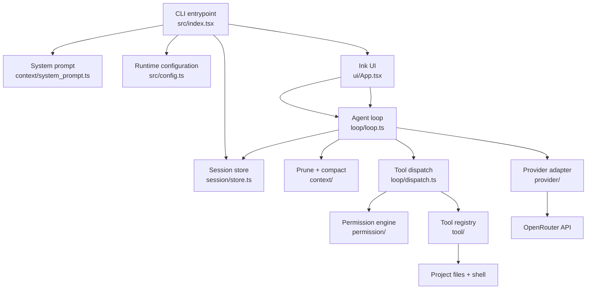

# Agent Harness

Agent Harness is a terminal-first AI coding agent built with TypeScript, React, and Ink. It connects an OpenRouter model to a controlled set of project tools so the agent can inspect a repository, plan changes, edit files, run commands, and present results in an interactive terminal session.

The project is designed as a small, understandable agent runtime: provider communication, the agent loop, context management, tool execution, permissions, persistence, and presentation are separated into focused modules.

## Highlights

- Interactive terminal UI built with React and [Ink](https://github.com/vadimdemedes/ink)
- OpenRouter model support with streaming and non-streaming completion paths
- Tool calling for shell commands, file reads, file creation, exact text replacement, and skills
- Permission checks for commands, paths, and edits before sensitive tool execution
- Context pruning and model-assisted compaction for long sessions
- Automatic model context-window discovery with a safe configured fallback
- Markdown rendering for assistant responses
- Atomic JSON session persistence and latest-session resume
- Type-safe tool schemas validated with [Zod](https://zod.dev/)

## Architecture



### Runtime flow

1. `src/index.tsx` loads configuration, discovers the selected model’s context window, generates the system prompt, and creates or resumes a session.
2. `ui/App.tsx` collects user input and renders assistant, tool, error, status, and permission events.
3. `loop/runLoop` builds the active message view and repeatedly requests a model completion until the model stops, the user interrupts, or a configured budget is reached.
4. When the model returns tool calls, `loop/dispatch.ts` routes them through the registry and records the resulting tool messages.
5. Before a sensitive command or edit runs, the permission layer checks its command/path policy and asks the user when required.
6. When the context approaches configured thresholds, older content is pruned and the transcript can be compacted into a summary before the next model request.
7. The resulting state is persisted as JSON so the latest session can be resumed later.

## Module guide

| Module | Responsibility |
| --- | --- |
| `src/index.tsx` | Application bootstrap, model discovery, prompt generation, and resume handling |
| `src/config.ts` | Loop, tool, UI, and local-state defaults |
| `src/provider/` | OpenRouter client, request conversion, response normalization, streaming, and usage stats |
| `src/loop/` | Agent iteration, stop conditions, tool-call dispatch, and loop events |
| `src/context/` | System prompt generation, context pruning, transcript compaction, and skills metadata |
| `src/tool/` | Tool contracts, registry, argument validation, execution, and output truncation |
| `src/permission/` | Command safety rules, path containment checks, allowlists, and user decisions |
| `src/session/` | Session lifecycle, JSON serialization, atomic writes, and latest-session loading |
| `src/ui/` | Ink components, Markdown rendering, history, status display, and permission prompts |
| `docs/` | Provider and tool implementation notes |

## Tools

The agent currently exposes the following tools:

- `bash` — runs a non-interactive shell command in the project context. Chained commands, redirects, and high-risk operations require approval.
- `read_file` — reads a bounded range of a text file and reports whether the result was truncated.
- `write_file` — creates a new file and refuses to overwrite an existing file.
- `str_replace` — replaces one exact, unique text span in an existing file.
- `load_skill` — loads a named project skill from `.agent-harness/skills/` without allowing path traversal.

Tool arguments are defined with Zod schemas, normalized into the provider’s tool format, and returned to the loop as typed tool messages.

## Permission model

Agent Harness treats tool execution as a policy decision rather than an unconditional capability.

- Read-only tools do not require an interactive permission decision.
- Project edits are allowed only inside the project root and otherwise require explicit approval.
- Shell commands are checked for chaining, pipes, redirects, command substitution, and other high-risk patterns.
- Destructive commands such as recursive removal, hard resets, forced pushes, and forced cleaning always require approval.
- Users can deny a request, allow it once, or add an exact/prefix rule for future requests in the session.

The permission layer is a safety boundary, not a replacement for reviewing model-generated commands. Review prompts and command output before allowing changes.

## Context management

The loop maintains both a complete message history and a smaller active view sent to the model.

- **Pruning** removes eligible tool-heavy content when the prompt reaches `pruneRatio` of the available context window.
- **Compaction** asks the configured compaction model to summarize older transcript content when the prompt reaches `compactionRatio`.
- **Budgets** stop the loop after the configured maximum iterations or token budget.
- **Interrupt handling** records an interruption marker so a resumed turn is not misinterpreted by the model.

## Requirements

- [Bun](https://bun.sh/) 1.x
- An [OpenRouter](https://openrouter.ai/) API key
- A terminal capable of rendering ANSI output

## Installation

```bash
git clone https://github.com/ankit25bcs10610/abcd.git
cd abcd
bun install
```

Configure the provider credential in your environment:

```bash
export OPENROUTER_API_KEY="your-api-key"
```

You may place the same variable in a local `.env` file. Do not commit secrets; `.env` files are ignored by Git.

## Usage

Start an interactive session:

```bash
bun run dev
```

Resume the most recently saved session:

```bash
bun run dev -- --continue
```

Run the entry point directly when needed:

```bash
bun src/index.tsx
```

Sessions are stored locally as JSON under `.agent-harness/sessions/`.

## Configuration

Runtime defaults live in [`src/config.ts`](src/config.ts):

| Setting | Default | Purpose |
| --- | --- | --- |
| `loopModel` | `anthropic/claude-haiku-5.5` | Primary coding-agent model |
| `compactionModel` | `openrouter/free` | Model used to summarize older context |
| `maxIterations` | `20` | Maximum model/tool iterations per turn |
| `maxTokens` | `200000` | Total token budget for a loop |
| `contextWindow` | `128000` | Fallback context size when provider discovery fails |
| `pruneRatio` | `0.5` | Prompt utilization threshold for pruning |
| `compactionRatio` | `0.9` | Prompt utilization threshold for compaction |

The provider attempts to discover the selected model’s current context length from OpenRouter and falls back to `contextWindow` when the request is unavailable or times out.

## Development commands

```bash
bun run dev          # Start the interactive agent
bun run watch        # Start with Bun watch mode
bun run typecheck    # Run the TypeScript compiler without emitting files
bun run format       # Format source files with Prettier
bun run format:check # Verify formatting
```

There is currently no automated test script configured in `package.json`. Type checking and formatting are the available repository-level validation commands.

## Project layout

```text
.
├── assets/             Project assets
├── docs/               Provider and tool notes
├── src/
│   ├── context/        Prompt, pruning, and compaction
│   ├── loop/           Agent loop and dispatch
│   ├── permission/     Command and path safety checks
│   ├── provider/       OpenRouter integration
│   ├── session/        Persistence and resume support
│   ├── tool/           Registry and tool implementations
│   ├── ui/             Ink terminal interface
│   └── util/           Shared helpers
├── package.json        Scripts and dependencies
├── tsconfig.json       TypeScript configuration
└── bun.lock            Reproducible Bun dependency lockfile
```

## Security and operational notes

- Never commit `OPENROUTER_API_KEY` or other credentials.
- Treat model-generated shell commands and file edits as untrusted until reviewed.
- Keep permission prompts enabled for destructive commands and edits outside the project root.
- Session JSON may contain conversation content; protect the local `.agent-harness/` directory appropriately.
- The OpenRouter API and selected model determine external data handling, cost, rate limits, and availability.

## License

This project is licensed under the MIT License. See [`LICENSE`](LICENSE) for the complete license text.

## Author

**Ankit Pandey**

`ankit.25bcs10610@sst.scaler.com`
