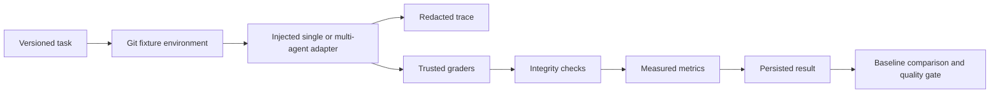

# Evaluation and Benchmarking

Chiku's evaluation subsystem measures agent runs against versioned benchmark tasks. It is an application-side harness, not a claim that an agent is correct merely because a model responded successfully.

## Execution flow

Tasks are Zod-validated and include a fixture path, optional base commit, workspace policy, budgets, expected outcomes, verification commands, allowed paths, dataset version, and required trusted graders. The registry rejects duplicate suites and task identifiers.

`EvaluationEngine` receives an adapter explicitly. `createLoopEvaluationAdapter` connects the real `runLoop` to the harness; `createMultiAgentEvaluationAdapter` is a boundary for a coordinator-backed runner. This keeps evaluation from silently changing production execution behavior and allows deterministic mock providers in tests.

## Safety and integrity

- Required isolation fails closed because this repository does not currently ship an OS/container isolation backend.
- Verification commands run through the controlled process executor in the evaluation workspace.
- Grader implementations are application-controlled and must declare `trusted: true`; benchmark data cannot install arbitrary grader code.
- File-scope, repository-state, patch, task-assertion, security-policy, and runtime-failure graders produce evidence rather than inferred success.
- Trace data has stable evaluation/run/event IDs and redacts common credential fields. It is bounded before persistence.
- Results and experiments are written atomically. Invalid experiment records are skipped when listing; they are not deleted.

## Metric semantics

Missing provider usage is represented as `null`, never as zero. Cost is `measured`, `estimated`, or `unknown`; the current engine does not invent a price when a provider has not reported one. Reliability counters are supplied by the adapter or remain zero when no failure event was observed. A zero counter is not proof that the behavior was exhaustively tested.

Baseline comparison reports improved, regressed, unchanged, or missing tasks. Quality gates can block on sample size, regression rate, and safety regressions. Improvement proposals are evidence-backed descriptions only; they do not edit source code or automatically rerun experiments.

## Terminal inspection

The UI currently supports:

- `/benchmark` — registered suites
- `/eval list` — in-process results
- `/eval <id>` — a full result
- `/eval trace <id>` — redacted trace events
- `/eval failures <id>` — non-passing graders
- `/experiments` — persisted experiments
- `/improve` — evidence-backed candidates from loaded results

These commands inspect and report. A benchmark must be registered and run through `EvaluationEngine.runSuite` by application code; the UI does not fabricate tasks or execute an arbitrary command from terminal input.

## Current limitations

The following are intentionally not claimed as complete: live model/provider comparison orchestration, calibrated cost estimation, failure-injection campaigns, broad language-aware grading, a dedicated OS/container sandbox, a durable experiment runner with trial scheduling, and the full `/eval run`, compare, security, reliability, model, and agent command surface. These require real fixtures and policy decisions. No benchmark score or performance improvement is reported until an actual run produces it.
